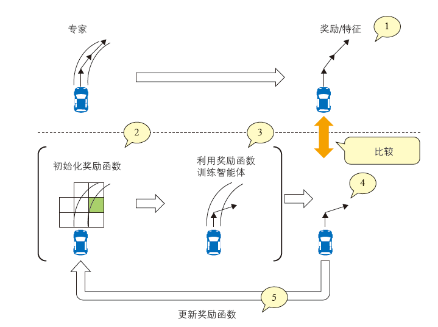

# 七天搞定强化学习

[Pythonで学ぶ強化学習 -入門から実践まで-](https://www.amazon.co.jp/dp/4065142989/)的实现代码库。

误记和样板代码的执行错误，由Issue进行管理。

**[Issue List](https://github.com/icoxfog417/baby-steps-of-rl-ja/issues)**

* [原书第3版的修正点](https://github.com/icoxfog417/baby-steps-of-rl-ja/milestone/1?closed=1)
  * [源代码的修正点](https://github.com/icoxfog417/baby-steps-of-rl-ja/pull/17/files)
* [原书第2版的修正点](https://github.com/icoxfog417/baby-steps-of-rl-ja/milestone/2?closed=1)
  * [源代码的修正点](https://github.com/icoxfog417/baby-steps-of-rl-ja/pull/35/files)


误记、拼写错误等意见，以及板代码的执行错误请使用[Issue](https://github.com/icoxfog417/baby-steps-of-rl-ja/issues/new)与我联系。

* 请事先确认Issue中是否已经有这个问题了。
* 关于执行错误，请按照模板来记录执行环境以及发生的错误。

## 索引

* [Setup](https://github.com/icoxfog417/baby-steps-of-rl-ja#setup)
  * [Setup with GPU](https://github.com/icoxfog417/baby-steps-of-rl-ja#setup-with-gpu)
* [第1章: 了解强化学习](https://github.com/icoxfog417/baby-steps-of-rl-ja#day1-%E5%BC%B7%E5%8C%96%E5%AD%A6%E7%BF%92%E3%81%AE%E4%BD%8D%E7%BD%AE%E3%81%A5%E3%81%91%E3%82%92%E7%9F%A5%E3%82%8B)
* [第2章: 强化学习的解法 (1)：根据环境制订计划](https://github.com/icoxfog417/baby-steps-of-rl-ja#day2-%E5%BC%B7%E5%8C%96%E5%AD%A6%E7%BF%92%E3%81%AE%E8%A7%A3%E6%B3%951-%E7%92%B0%E5%A2%83%E3%81%8B%E3%82%89%E8%A8%88%E7%94%BB%E3%82%92%E7%AB%8B%E3%81%A6%E3%82%8B)
* [第3章: 强化学习的解法 (2)：根据经验制订计划](https://github.com/icoxfog417/baby-steps-of-rl-ja#day3-%E5%BC%B7%E5%8C%96%E5%AD%A6%E7%BF%92%E3%81%AE%E8%A7%A3%E6%B3%952-%E7%B5%8C%E9%A8%93%E3%81%8B%E3%82%89%E8%A8%88%E7%94%BB%E3%82%92%E7%AB%8B%E3%81%A6%E3%82%8B)
* [第4章: 使用面向强化学习的神经网络](https://github.com/icoxfog417/baby-steps-of-rl-ja#day4-%E5%BC%B7%E5%8C%96%E5%AD%A6%E7%BF%92%E3%81%AB%E5%AF%BE%E3%81%99%E3%82%8B%E3%83%8B%E3%83%A5%E3%83%BC%E3%83%A9%E3%83%AB%E3%83%8D%E3%83%83%E3%83%88%E3%83%AF%E3%83%BC%E3%82%AF%E3%81%AE%E9%81%A9%E7%94%A8)
* [第5章: 强化学习的弱点](https://github.com/icoxfog417/baby-steps-of-rl-ja#day5-%E5%BC%B7%E5%8C%96%E5%AD%A6%E7%BF%92%E3%81%AE%E5%BC%B1%E7%82%B9)
* [第6章: 克服强化学习弱点的方法](https://github.com/icoxfog417/baby-steps-of-rl-ja#day6-%E5%BC%B7%E5%8C%96%E5%AD%A6%E7%BF%92%E3%81%AE%E5%BC%B1%E7%82%B9%E3%82%92%E5%85%8B%E6%9C%8D%E3%81%99%E3%82%8B%E3%81%9F%E3%82%81%E3%81%AE%E6%89%8B%E6%B3%95)
* [第7章 强化学习的应用领域](https://github.com/icoxfog417/baby-steps-of-rl-ja#day7-%E5%BC%B7%E5%8C%96%E5%AD%A6%E7%BF%92%E3%81%AE%E6%B4%BB%E7%94%A8%E9%A0%98%E5%9F%9F)

[Support Content](https://github.com/icoxfog417/baby-steps-of-rl-ja#support-content)  

## 安装

下载样板代码需要使用Git，运行需要Python的环境。因此，请下载并安装以下两个软件。此外，本书使用基于Miniconda的Python环境。

1. [Git](https://git-scm.com/)
2. [Python (Miniconda)](https://conda.io/miniconda.html)
   * 下载Python3的版本

安装结束之后，首先下载源代码。请打开终端/命令行工具，并在工作目录中执行以下命令。

```
git clone https://github.com/icoxfog417/baby-steps-of-rl-ja.git
```

这个命令执行之后、将创建名为`baby-steps-of-rl-ja`的目录。这样下载就完成了。将其移动到下载的文件夹吧。

```
cd baby-steps-of-rl-ja
```

然后，来创建源代码的运行环境。首先，在安装Miniconda后，可以使用的`conda`命令来创建执行环境。接下来，我们将创建一个环境，也就是本书的执行环境`rl-book`。

```
conda create -n rl-book python=3.6
conda activate rl-book
```

执行`conda activate`之后，在终端的开头会显示`（rl-book）`。这表示运行环境已经启用。执行本书的源代码时，首先请确认执行环境是否有效化，也就是查看`（rl-book）`是否在开头。此外，要禁用时请执行`conda deactivate`的命令。

在执行环境中，安装执行所需的程序库，请先确认`（rl-book）`位于开头后再执行操作。

```
pip install -r requirements.txt
```

如下，请试一下执行`welcome.py`。如果游戏画面正常启动，设置就完成了。

```
python welcome.py
```

## Setup with GPU

Day4中，使用深度学习的强化学习算法（DQN/A2C），这类学习算法必须使用GPU，否则需要消耗数日来进行训练。

使用GPU的训练过程中，GPU自然是必须的（更具体地说，是NVIDIA的GPU）。使用GPU的方法有如下两种：

1. 使用搭载GPU的主机
2. 使用云平台的GPU
    * 使用云平台的GPU实例
    * 使用Google Colaboratory的GPU

### 本地 GPU 的安装

使用搭载GPU的机器，由以下3个步骤进行安装：

1. 下载安装 NVIDIA Driver
    * [NVIDIA驱动下载](https://www.nvidia.co.jp/Download/index.aspx?lang=cn)
    * 基本上可以选择自动下载驱动程序。如果不选择，请手动选择并下载。

2. 安装 CUDA Toolkit
    * 由[CUDA Toolkit Archive](https://developer.nvidia.com/cuda-toolkit-archive)下载TensorFlow所对应的版本[TensorFlow 1.13以上的版本是CUDA 10](https://www.tensorflow.org/install/gpu))。
3. 安装 cuDNN
    * 下载[cuDNN](https://developer.nvidia.com/cudnn)后、展开Toolkit的文件路径。另外cuDNN的下载需要登录用户。
4. 作为`tensorflow`的替代、安装`tensorflow-gpu`(如果已经安装了`tensorflow`，请先卸载）。

运行 `import tensorflow as tf` 如果没有报错，则表明安装完成了。

```
> python
>>>  import tensorflow as tf
```

### Cloud GPU Machine Setup

AWS和Azure，GCP都提供GPU实例。如果使用这些服务的话，就没有必要准备搭载GPU的主机。GPU的安装步骤与[Local GPU Machine Setup](https://github.com/icoxfog417/baby-steps-of-rl-ja#local-gpu-machine-setup)一样。如果是已经安装的实例（如SageMaker），则无需再进行安装。

使用GPU实例当然会产生不菲的费用。因此，下面介绍能够免费使用GPU来计算的Google Colaboratory。

* [Day4: 对价值近似使用深度学习: Deep Q-Network](https://colab.research.google.com/drive/1QZs38jqCaSIpoKmoIl8XxVJUwdG78Hb8)
* [Day4: 对策略使用深度学习: Advantage Actor Critic(A2C)](https://colab.research.google.com/drive/1IzXGuNj4ZbsuWC7ei98ZzKrVk7mPS1t-)

Google Colaboratory是能够在线使用Jupyter Notebook的服务。也可以使用GPU进行计算，但是执行的时间有限。虽然不能长期执行，但是可以在可能的范围内进行训练并下载模型。

## Day1: 了解强化学习

**Day1's Goals**

* 理解强化学习与机器学习、人工智能这些关键词之间的关系
* 理解强化学习相对于其他机器学习方法的优点和缺点
* 理解强化学习的基本机制

**Summary**

* 强化学习是什么?
  * 强化学习 ⊂ 机器学习 ⊂ 人工智能。
  * 机器学习 = 学习「机器」(=模型)的方法。
  * 强化学习 = 「学习」方法的其中一种。
  * 强化学习的目的是将通过连续动作，来获得的“回报总和”的最大化。
  * 学习“动作的评价方法”和（基于评价）选择动作的方法（=策略）。

* 强化学习的优点和缺点
  * 优点：即使难以评价的任务也可以处理（因为是学习动作的评价方法）。
  * 缺点: 学习什么行动是无法控制的（因为是模型自己获得的）。

* 强化学习的基本构造
  * 在强化学习中，假设所设定的“环境”遵循一定的规则。
  * 这个规则被称为 **马尔科夫决定过程（Markov Decision Process: MDP）**。
  * MDP的构成要素及其关系如下图所示。
  * MDP的奖励由“之前的状态和下一个状态”所决定。
  * 这种奖励被称为 ** 即时奖励(Immediate reward)**。
  * 奖励的综合(=即时奖励的总和)事先是不知道的。
  * 因此进行估计时，估计的价值被称为 **期望奖励 (Expected reward)** 、或者 **价值(Value)**。
  * 在估算时，对将来的即时奖励进行折扣来考虑。
  * 折扣系数被称为 ** 折扣率(discount factor)**。

<p align="center">
  
  <p align="center">MDP的构成要素及其关系</p>
</p>

**Exercises**

* [MDP的实现](https://github.com/icoxfog417/baby-steps-of-rl-ja/blob/master/DP/environment.py)

## Day2: 强化学习的解法 (1)： 根据环境制订计划

**Day2's Goals**

* 理解作为行动评价指标的价值的定义
* 理解使用动态规划法学习价值近似的理论方法和代码实现
* 理解使用动态规划法学习策略的理论方法和代码实现
* 理解基于模型的方法和无模型的方法的区别

**Summary**

* “价值的定义”
  * Day1定义的“价值”的计算需要将来的即时奖励。
  * 将来的即时奖励在计算阶段是不知道的。
  * 通过递归来定义公式，从而能够对未知值进行计算。
  * 可能发生的即时回报有几个候选值，按照概率进行选择。
  * 因此，奖励的值用期望值（概率x值）来表示（动作概率x即时奖励）。
  * 将“价值”以递归和期望值计算的公式就是“**Bellman Equation**”。

* 状态“价值”的学习和“策略”的学习
  * **Bellman Equation** 在计算期望值时使用策略（动作概率）。
  * 如果计算出期望值（价值），也会基于此进行策略修正（修正是为了更高的价值）。
  * 价值的计算、策略的更新、价值的再计算......按照这样的处理反复进行。
  * 在动态计划中，将策略与价值相互交替更新的过程称为 **Policy Iteration**。
  * 也有如果价值可以被算出的话，则选择价值最高的动作，这种朴素的想法。
  * 这种情况下，价值=策略。
  * 在动态计划中，由价值=策略，而只更新价值的过程被称为 **Value Iteration**。
  * 基于策略（基于Policy），以及价值=策略（基于Value）是强化学习的重要观点。

* 基于模型与无模型。
  * 在动态计划法中，可以完全不移动智能体而实现对策略/价值的学习
  * 这种方法之所以可行，是因为转移函数和奖励函数已知，从而可以进行模拟。
  * 种基于环境信息的学习方法被称为 ** model-based ** 方法。
  * 然而由于很少能知道转移函数和奖励函数，所以实际上会进行预测。
  * 以实际运行智能体来获得的经验为基础，来进行学习的方法被称为**model-free**方法
  * 因为不需要模型的信息（转移函数/奖励函数），所以被称为模型“free”
  * 环境越复杂越难以估计模型，因此一般情况下多采用无模型方法。
  * 然而由于拟合能力强的DNN的出现，不再受到这个限制。
  * 另外也有很多尝试同时使用 model-based 和 model-free 的方法。

**Exercises**

* [价值的定义: Bellman Equation的实现](https://github.com/icoxfog417/baby-steps-of-rl-ja/blob/master/DP/bellman_equation.py)
* [价值迭代(Value Iteration)、策略迭代(Policy Iteration)的实现](https://github.com/icoxfog417/baby-steps-of-rl-ja/blob/master/DP/planner.py)

准备了用于 Value Iteration/Policy Iteration 测试执行结果的模拟器。
请执行以下脚本，并访问启动的server([按这里试试](https://baby-step-of-rl-ja-dp.herokuapp.com/))。

```
python DP/run_server.py
```

http://localhost:8888/


* 由Area指定行列，按下 Draw 按钮可以生成指定尺寸的迷宫
* 选择迷宫的单元格后，按下 Cell Setting 按钮可以生成迷宫的方阵的属性
* 以 Treasure 是正值奖励、Danger 是负值奖励为目标。Block 是锁定单元格。
* 设置好迷宫之后，按下 Simulation 按钮求解路径。
* Value Iteration/Policy Iteration 如果按下其中任意一个按钮，则可以参照对应按钮的算法求解的结果。

## Day3: 强化学习的解法 (2)： 根据经验制订计划

**Day3's Goals**

* 在利用采取行动而积累的经验时，需要研究以下 3 点
   1. 平衡经验的积累与利用
   2. 是根据实际奖励还是奖励估计值来修正计划
   3. 是将经验用于价值近似的更新还是策略的更新
* 理解各个观点的对应关系
* 实现各个观点的代表性方法

**Summary**

* 所谓“经验”
  * 具有“动作前”估算的价值与“动作后”判明的实际价值之间的差异。
  * 执行动作越多，实际的即时奖励就越精确，依赖估计的部分就越少。
  * 这也可以说是“动作前”和“动作后”的时间差。。
  * 因此这被称为 **TD误差(Temporal Difference error)**。

<p align="center">
  
  <p align="center">经验=TD误差</p>
</p>

* 平衡经验的积累与利用
  * 无模型算法中转移函数/奖励函数是未知的。
  * 因此，为了提高“经验”的可信度，需要进行多次尝试。
  *（买了一次彩票就中奖了，并不是彩票中奖概率就为100%）。
  * 动作的次数通常是有限的。
  * 因此，有必要将动作次数划分为用于“提高经验的可信度”（提高估计精度）和“相信经验的动作”。
  * 这被称为探索与利用的折中 (Exploration-Exploitation Trade-off)**。
  * (探索=提高可信度、利用=相信经验的动作)。
  * 以 Epsilon 的概率切换探索/活用的方法、被称为 **Epsilon-Greedy 方法** 。

* 是根据实际奖励来修正计划还是根据预测来修正计划
  * “动作后”最短会动作一次，最长发生在的一个片段结束后。
  * 前者是 **TD方法(TD(0))** 、后者被称为 **Monte Carlo 方法**。
  * “动作后”越长，越能根据实际收益进行修正，相应地，修正的时机来得越晚。
  * 实际收益 / 时机存在折中。
  * TD(0)方法与Monte Carlo方法之间的方法也是有可能的。
  * 将“动作后”放在多个step之后的方法称为“**Multi-step learning**”。
  * step数不同的经验组合的方法称为 **TD(λ)法**。

* 用经验来更新价值近似还是策略：基于价值还是基于策略
  * 经验可用价值 / 策略基于（Value/Policy）来进行更新。
  * 根据 TD 方法更新行动价值的手法被称为 **Q-learning**。
  * ("Q" 是经常被用作表示动作价值的符号。与此相对，状态的价值多用"V")。
  * 基于 TD 方法进行策略更新的方法被称为 **SARSA(State–action–reward–state–action)**。
  * SARSA 进行价值估计时，以策略决定之前的动作为前提。这个前提被称为 **On-policy**。
  * 像基于 Value 的方法那样，选取“获得最大价值的动作”，这种情况被称为 **Off-policy**。
  * (没有策略=因此被称为 Off)。
  * Q-learning 是 Off-policy 方法、SARSA 是 On-policy 方法。
  * SARSA 在策略评价和策略使用上基于相同的“Q”。
  * 与此相对，也可以像 Policy Iteration 那样将评价和策略分开。
  * 策略侧是 Actor、评价侧是 Critic 的分离方法被称为 **Actor-Critic**。
  * Actor-Critic 可以说是 Policy-base(Actor)与Value-base(Critic)的共用形式。


按照更新方法(估计值/实际值)、更新対象(价值/策略)、行动基准(On-policy/Off-policy)的三种观点分类，总结如下。

<table>
  <tr>
    <th rowspan="2"></th>
    <th colspan="2">更新方法</th>
    <th colspan="2">更新対象</th>
    <th colspan="2">行动基准</th>
  </tr>
  <tr>
    <td>估计值</td>
    <td>实际值</td>
    <td>价值</td>
    <td>策略<br></td>
    <td>Off-policy</td>
    <td>On-policy</td>
  </tr>
  <tr>
    <td>Q-learning</td>
    <td>○</td>
    <td></td>
    <td>○</td>
    <td></td>
    <td>○</td>
    <td></td>
  </tr>
  <tr>
    <td>Monte Carlo</td>
    <td></td>
    <td>○</td>
    <td>○</td>
    <td></td>
    <td>○</td>
    <td></td>
  </tr>
  <tr>
    <td>SARSA</td>
    <td>○</td>
    <td></td>
    <td colspan="2" align="center">○</td>
    <td></td>
    <td>○</td>
  </tr>
  <tr>
    <td>Actor Critic</td>
    <td>○</td>
    <td></td>
    <td>○</td>
    <td>○</td>
    <td></td>
    <td>○</td>
  </tr>
  <tr>
    <td>Off-policy Actor Critic</td>
    <td>○</td>
    <td></td>
    <td>○</td>
    <td>○</td>
    <td>○</td>
    <td></td>
  </tr>
  <tr>
    <td>On-policy Monte Carlo</td>
    <td></td>
    <td>○</td>
    <td>○</td>
    <td>○</td>
    <td></td>
    <td>○</td>
  </tr>
  <tr>
    <td>Off-policy Monte Carlo</td>
    <td></td>
    <td>○</td>
    <td>○</td>
    <td>○</td>
    <td>○</td>
    <td></td>
  </tr>
</table>

**Exercises**

* 平衡经验的累积与利用
  * [Epsilon-Greedy法](https://github.com/icoxfog417/baby-steps-of-rl-ja/blob/master/EL/notebooks/Epsilon%26Greedy.ipynb)
* 是根据实际奖励还是奖励估计值来修正计划
  * [Monte Carlo](https://github.com/icoxfog417/baby-steps-of-rl-ja/blob/master/EL/notebooks/Monte%20Carlo.ipynb)
  * [Temporal Difference](https://github.com/icoxfog417/baby-steps-of-rl-ja/blob/master/EL/notebooks/Q-learning.ipynb)
* 経是将经验用于价值近似的更新还是策略的更新
  * [Value-base & Off policy: Q-learning](https://github.com/icoxfog417/baby-steps-of-rl-ja/blob/master/EL/notebooks/Q-learning.ipynb)
  * [Policy-base & On policy: SARSA](https://github.com/icoxfog417/baby-steps-of-rl-ja/blob/master/EL/notebooks/SARSA.ipynb)
  * [Value-base & Policy-base: Actor Critic](https://github.com/icoxfog417/baby-steps-of-rl-ja/blob/master/EL/notebooks/Actor%26Critic.ipynb)

## Day4: 使用面向强化学习的神经网络

**Day4's Goals**

* 使用神经网络作为函数的优点
* 使用含有参数的函数实现价值近似的方法
* 使用含有参数的函数实现策略的方法

**Summary**

* 价值评估 / 策略的函数化
  * 截至 Day3，我们使用Q[s][a]的表格来管理状态对应动作的价值。
  * 然后这种形式在状态数/动作数变多的情况下，就会无法进行下去。
  * 表格函数化，是应用于组合爆炸的一种解决方案。
  * 使用函数（深度）特别把使用神经网络应用于强化学习的方法称为“深度强化学习”。

* 使用神经网络作为函数的优点和缺点
  * 可以将更接近人类实际观察到的“状态”的数据，用于智能体的学习。
  * 这是因为 DNN 擅长于特征提取（如果是图像则是 CNN 等）。
  * 但是，使用神经网络也存在训练时间长等缺点(详见[Day5](https://github.com/icoxfog417/baby-steps-of-rl-ja#day5-%E5%BC%B7%E5%8C%96%E5%AD%A6%E7%BF%92%E3%81%AE%E5%BC%B1%E7%82%B9))。

* 用具有参数的函数进行价值评估
  * 在神经网络中实现接受状态并输出动作价值（=Q）的函数（Q-function）。
  * 将使用 CNN 作为神经网络的结构称为 **Deep Q-Network (DQN)**。
  * 在 DQN 以前也有使用神经网络的相关研究。但是，当时有学习过程不稳定的问题。
  * DQN 采取3个途径来克服学习不稳定的问题。
  * 3个途径分别为 **Experience Reply** 、**Fixed Target Q-Network** 、** 奖励 Clipping**。
  * [Rainbow](https://arxiv.org/abs/1710.02298)整合了DQN算法中的六种变体。


* 使用参数化函数来实现策略
  * 策略输出是按照动作概率，而不能像价值那样以事前/事后的差值来评价。
  *（在选择A和B时，可以评价所选的 A 和所预期的有多大不同（差分评价）。
  *（但是如果取了B的话会怎么样呢？不把退回到之前就能不知道)。
  * 因此不是像使用价值时那样缩小差距，而是纯粹地将策略所得到的期望值最大化。
  * 期望值可以用概率X值来计算。
  * 策略的期望值可以用「状态转移概率」X「动作概率」X「动作价值」来计算(J(θ))。
  * 期望值使用梯度法最大化进行求解。这个方法称之为 **策略梯度法(Policy Gradient)**。
  * 「通过动作获得的价值」正如在Day3上学到的那样，有通过预测来估计值/根据实际值来计算等各种各样的变体。
  * 将动作的价值减去状态的价值，将纯粹的动作的价值部分称为 **Advantage**。
  * Advantage 可以根据动作的实际奖励(Monte Carlo)、状态的价值(TD)来进行计算。
  * 以状态的价值为Critic、策略为Actor，使用 Advantage 的学习方法称之为 **Advantage Actor Critic (A2C)**。
  * 策略梯度法以「当前策略的经验」来进行更新、因此不能通过 Experience Reply 使用过去的经验。
  * 策略梯度法中梯度的更新方法非常敏感。
  * 因此，TRPO 和 PPO 都是为了不发生大幅度的更新而逐渐学习的方法。

* 是价值近似还是策略呢
  * 价值评价有两个缺点。
  * 1. 即使价值很接近的两种动作，也只采取“最大”（稍微大一点的）。
  * 2. 动作数增加的情况下难以应对。
  * 使用策略的情况下，根据价值的大小分配概率，即使动作数增加（在连续的情况）也可以处理。
  * (A2C输出了各种动作的概率，实质上和价值评价有相同的问题。有两种克服这个的方法）。
  * 1. 像价值评价一样，输出最佳的一个动作的方法(Deterministic=确定性 Policy Gradient= **DPG**)
  * 2. 输出动作分布的参数（均值、方差等）的方法。
  * 然而策略的学习与价值评价的学习相比，比较不稳定。
  * 直到 2018年，Policy Gradient 的学习是否按照既定目标进行还不清楚
  * 现有的方法可以如下进行分类。

<p align="center">
  
  <p align="center">强化学习方法的分类</p>
</p>

**Exercises**

* [神经网络的结构](https://github.com/icoxfog417/baby-steps-of-rl-ja/tree/master/FN/nn_tutorial)
* [价值函数的实现](https://github.com/icoxfog417/baby-steps-of-rl-ja/blob/master/FN/value_function_agent.py)
  * [实现使用 DNN 的价值函数: DQN](https://github.com/icoxfog417/baby-steps-of-rl-ja/blob/master/FN/dqn_agent.py)
* [实现参数化策略函数: Policy Gradient](https://github.com/icoxfog417/baby-steps-of-rl-ja/blob/master/FN/policy_gradient_agent.py)
  * [实现使用 DNN 的参数化策略函数 A2C](https://github.com/icoxfog417/baby-steps-of-rl-ja/blob/master/FN/a2c_agent.py)

## Day5: 强化学习的弱点

**Day5's goals**

下面介绍强化学习，特别是利用神经网络的深层强化学习的弱点。有以下3点。

* 获取样本的效率低
* 容易陷入局部最优行动和过拟合
* 复现性差

**Summary**

* 获取样本的效率低
  * 在 Rainbow 的论文中、Atari 游戏记录了达到人类同等的分数需要多少的学习量。
  * 由此即使用了 Rainbow 也需要166小时的学习时间(30fps的情况下)。
* 陷入局部最优的动作中，常常造成过拟合
  * 局部最优: 在对战游戏的情况下，学习到只能战胜特定对手的方法。
  * 过拟合: 学习到游戏所谓的作弊手段等。
  * ・・・有时会发生这样的事情。
* 复现性差
  * 且不说超参数的设定，即使是每次执行结果都会有发生变化的情况。
* 对策
  * 根本对策是[Day6](https://github.com/icoxfog417/baby-steps-of-rl-ja#day6-%E5%BC%B7%E5%8C%96%E5%AD%A6%E7%BF%92%E3%81%AE%E5%BC%B1%E7%82%B9%E3%82%92%E5%85%8B%E6%9C%8D%E3%81%99%E3%82%8B%E3%81%9F%E3%82%81%E3%81%AE%E6%89%8B%E6%B3%95)中介绍的，针对Day5中的弱点进行应对。
  * 对策的基本原则是“不浪费一次学习的结果”。
  * 由于「复现性差」需要多次实验。
  * 但是，由于“获取样本的效率低”，学习需要很多时间。
  * 因此，一次实验由 长时间 X 多次运行 而成，当然很花时间。
  * 需要尽可能地避免花费时间的实验，和因无谓的错误而导致重做的情况。
  * 另外，要通过一次实验尽可能地获取信息。
  * 为了实现这一点，在Day4以后的实现中使用了“模块分割”和“日志获取”两个操作。

<p align="center">
  
  <p align="center">强化学习的实现框架</p>
</p>

## Day6: 克服强化学习弱点的方法

**Day6's goals**

Day6将介绍针对Day5中出现的的弱点根本性的解决办法(算法上的改良)。

* 「获取样本的效率低」的解决办法
* 「复现性差」的解决办法
* 「容易陷入局部最优行动和过拟合」的解决办法

**Summary**

* 「获取样本的效率低」的解决办法
  * 关于改善强化学习中采样效率，提出了各种各样的方法（参照下表）。
  * 本书涉及其中的“改善环境的认识”。
  * 深度强化学习主要处理画面等（人类接受的）接近原始的数据类型。
  * 因此，模型需要同时学习“从输入（画面）中提取特征”和“选取动作的方法”。
  * 这就是学习效率低下的原因。
  * 在“改善环境的认识”中，支持从环境获取信息。有两种实现方法。
  * 与model-based一起使用: 制作环境的模拟器（模型），使其能够在抽象化的环境中学习。
  * 表征学习：将从环境中获得的状态，加工成更容易识别的表征方式。
  * 在本书中，将介绍作为与 model-based一起使用的算法， **Dyna**，以及作为表征学习的 **World Models** 方法。

<p align="center">
  
  <p align="center">改善获取样本的效率的方法一览</p>
</p>

* 「复现性差」的解决办法
  * 导致复现性差的主要原因之一是“学习的不稳定”。
  * 关于这一点，近年来与梯度法不同的优化算法受到广泛关注
  * 这就是 **遗传算法**。
  * 梯度下降法是“从初始状态开始逐渐改善”的方法。
  * 另一方面，遗传算法采取“从大量候选中筛选”的方法。

* 「容易陷入局部最优行动和过拟合」的解决办法
  * 作为解决办法，有一种简单的途径是“在一定程度上人工诱导”。关于此有两种方法：
  * **模仿学习**: 让人示范，并让智能体学习动作。
  * **逆强化学习**: 根据示范反过来推算回报，并以此为基础让智能体学习动作。
  * 模仿学习和监督学习相似，但在所有情况下都准备好范本是很困难的。
  * (避免事故的示例等)。
  * 因此有必要在以范本为基础的同时，也能有效应对范本以外的情况。
  * 逆强化学习过程如下（参照下图）。
  * 在通常的强化学习中，只需要3个过程就够了(Train Agent under Reward Function)。
  * 然而逆强化学习会更新奖励函数，并以更新后的奖励再次学习・・・不断重复。
  * 因此推测需要花费时间。但是有若干改善的方法。

<p align="center">
  
  <p align="center">逆强化学习的过程</p>
</p>

**Exercises**

* 「获取样本的效率低」的解决办法
  * [与 model-based一起使用的算法: Dyna](https://github.com/icoxfog417/baby-steps-of-rl-ja/tree/master/MM)
* 「复现性差」的解决办法
  * [新的学习方法: 遗传算法](https://github.com/icoxfog417/baby-steps-of-rl-ja/tree/master/EV)
* 「容易陷入局部最优行动和过拟合」的解决办法
  * [模仿学习: DAgger](https://github.com/icoxfog417/baby-steps-of-rl-ja/tree/master/IM)
  * [逆强化学习: MaxEntropy/Bayesian](https://github.com/icoxfog417/baby-steps-of-rl-ja/tree/master/IRL)


## Day7: 强化学习的应用领域

**Day7's goals**

* 理解应用强化学习的两种模式
* 了解应用强化学习的两种模式的研究和事例
* 了解应用强化学习的两种模式的工具和服务

**Summary**

* 应用强化学习的两种模式
  * 强化学习的应用大致可以分为“动作的最优化”和“学习的最优化”（参照下图）。
  * 动作的最优化，是通过强化学习提供的动作，照原样直接使用。
  * 学习的最优化，是利用强化学习的“奖励最大化”的学习过程。
  * 结合这两种类型，分别介绍了研究/事例/工具/服务。

<p align="center">
  
  <p align="center">强化学习的应用模式</p>
</p>

## Support Content

为初次接触编程的人准备了可供参考的内容。近年来学习编程的书籍等很丰富，可以用这些作为补充。

[python_exercises](https://github.com/icoxfog417/python_exercises)
